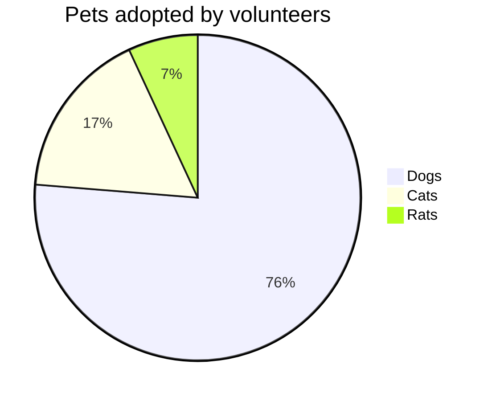
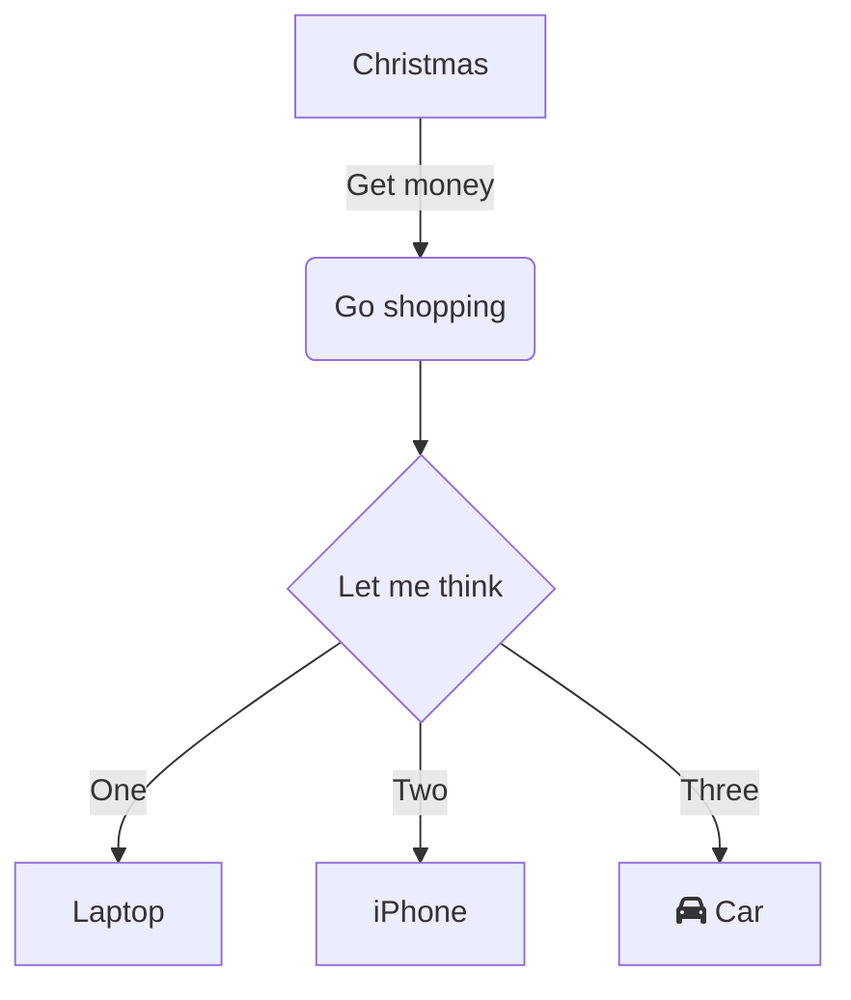
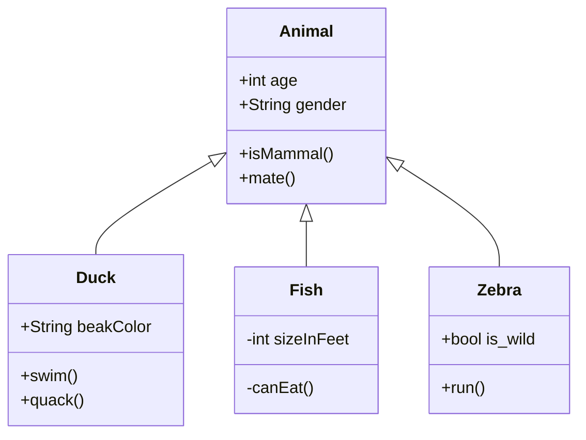
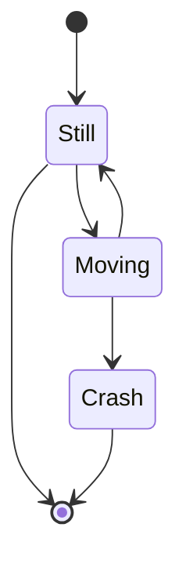

## 1. Pie chart

## 2. sequence diagram

@startmermaid
sequenceDiagram
  Alice ->> Bob: Hello Bob, how are you?
  Bob-->>John: How about you John?
  Bob--x Alice: I am good thanks!
  Bob-x John: I am good thanks!
  Note right of John: Bob thinks a long long time, so long that the text does not fit on a row.
  
  Bob-->Alice: Checking with John...
  Alice->John: Yes... John, how are you?
@endmermaid
 
 

## 3. Class diagram

## 4. State diagram

